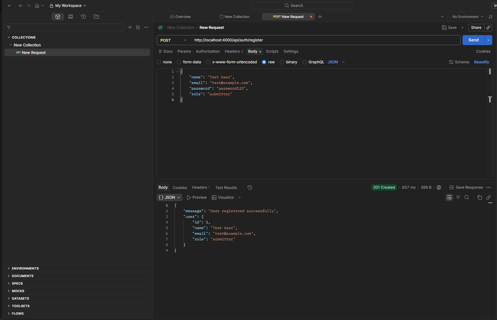
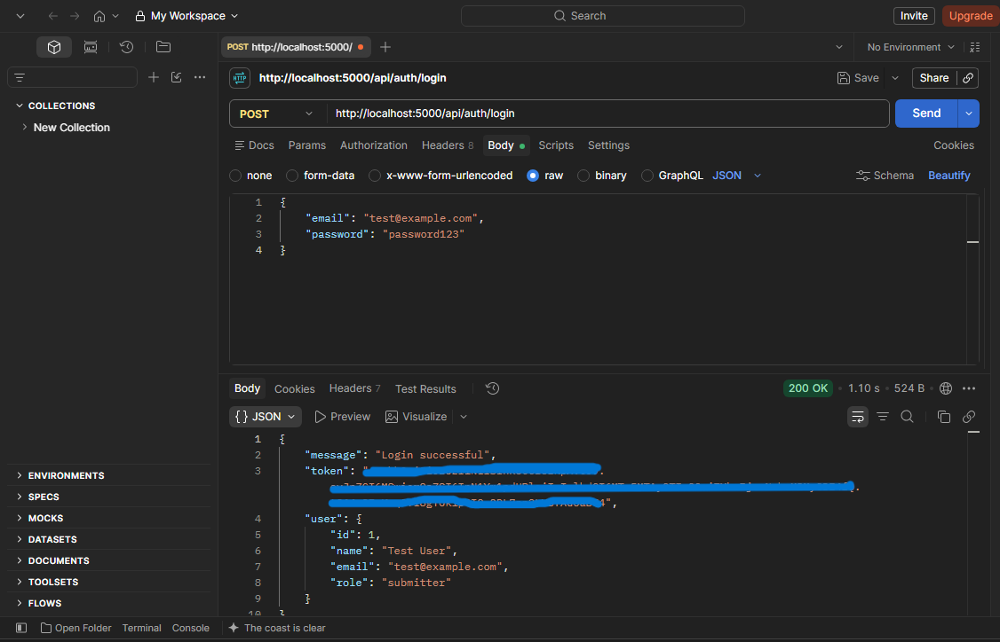
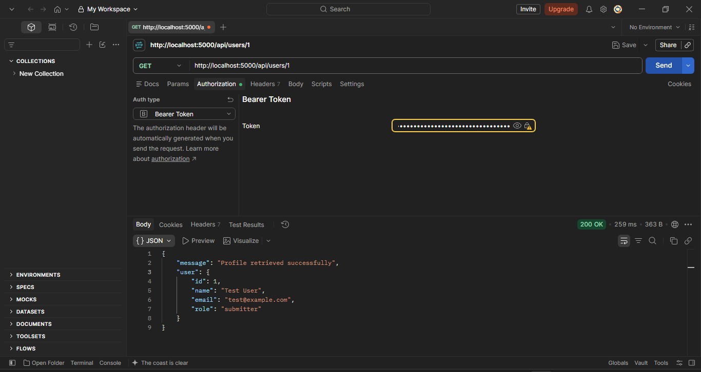

# Code Collaborative Review

A REST API for a collaborative code review platform where users can submit code, review submissions, provide feedback, and manage review workflows.

## Project Structure

```text
Collaborative-Code-Review-Platform/
├── src/
│   ├── config/
│   │   └── database.ts
│   ├── controllers/
│   │   └── authController.ts
│   ├── database/
│   │   └── schema.sql
│   ├── routes/
│   │   └── authRoutes.ts
│   ├── service/
│   │   └── userServices.ts
│   ├── types/
│   │   └── application.types.ts
│   └── server.ts
├── Assets/
├── .env
├── .gitignore
├── package.json
├── package-lock.json
└── tsconfig.json
```

## Setup

1. Initialize the project:

```bash
npm init -y
```

2. Install the main dependencies:

```bash
npm install express pg dotenv
```

3. Install the development dependencies:

```bash
npm install -D typescript nodemon @types/node @types/express @types/pg tsx
```

4. Initialize TypeScript:

```bash
npx tsc --init
```

## Authentication Setup

Install bcrypt and JSON Web Token:

```bash
npm install bcrypt jsonwebtoken
```

Install their TypeScript types:

```bash
npm install -D @types/bcrypt @types/jsonwebtoken
```

## Database Setup

PostgreSQL is used as the database.

The database contains the following tables:

- `users`
- `projects`
- `submissions`
- `comments`

The SQL schema can be found in:

```text
src/database/schema.sql
```

## Sprint 2 - Authentication & User Management

### Register User

**Endpoint**

```http
POST /api/auth/register
```

Registers a new user as either a `submitter` or `reviewer`.

**Example Request**

```json
{
  "name": "Test User",
  "email": "test@example.com",
  "password": "password123",
  "role": "submitter"
}
```

**Result**

```text
201 Created
```

<p align="center">
  
</p>

### Login User

**Endpoint**

```http
POST /api/auth/login
```

Logs in a registered user using their email and password. Returns a JWT token that expires after one hour.

**Example Request**

```json
{
  "email": "test@example.com",
  "password": "password123"
}
```

**Result**

```text
200 OK
```

The response contains a login token and the user's ID, name, email, and role. The password and password hash are not returned.

<p align="center">
  
</p>

### View User Profile

Retrieves the authenticated user's own profile. Users cannot access another user's profile.

**Endpoint**

```http
GET /api/users/:id
```

Replace `:id` with the user ID returned during login.

**Example Request**

```http
GET http://localhost:5000/api/users/1
Authorization: Bearer <your_login_token>
```

In Postman, select **Authorization → Bearer Token** and paste the token received during login. No request body is required.

**Successful Response — 200 OK**

```json
{
  "message": "Profile retrieved successfully",
  "user": {
    "id": 1,
    "name": "Test User",
    "email": "test@example.com",
    "role": "submitter"
  }
}
```

**Error Responses**

| Status | Meaning |
|---|---|
| 400 Bad Request | Invalid user ID. |
| 401 Unauthorized | Missing, invalid, or expired token. |
| 403 Forbidden | Attempting to access another user's profile. |
| 404 Not Found | The authenticated user's account no longer exists. |

**Screenshot**

<p align="center">
  
</p>