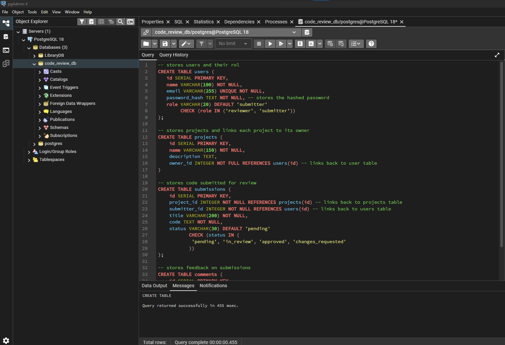

# Code Collaborative Review

## Project structure

```text
collaborative-code-review-platform/
├── src/
│   ├── config/
│   │   └── db.ts
│   ├── controllers/
│   ├── middleware/
│   ├── routes/
│   ├── app.ts
│   └── server.ts
├── database/
│   └── schema.sql
├── .env
├── .env.example
├── .gitignore
├── package.json
└── tsconfig.json
```

### setup
1. npm init -y

2. npm i express pg dotenv

3. npm i -D typescript ts-node nodemon @types/node @types/express @types/pg

4. npx tsc --init

## Registration/Password hashing 

5. npm install bcrypt jsonwebtoken

6. npm install -D @types/bcrypt @types/jsonwebtoken

### Database Setup

Created the users, projects, submissions, and comments tables using PostgreSQL in pgAdmin.

