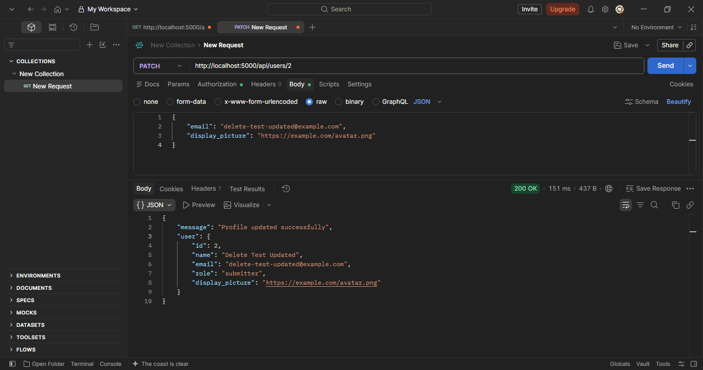
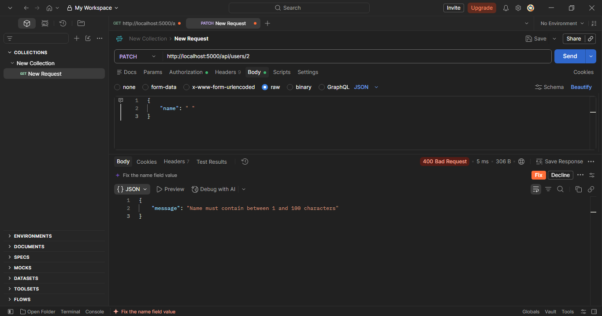
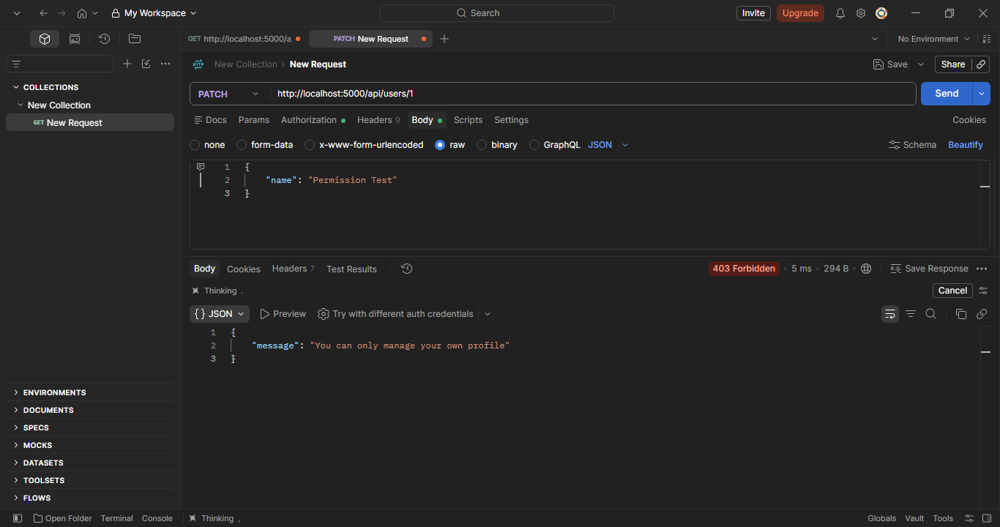
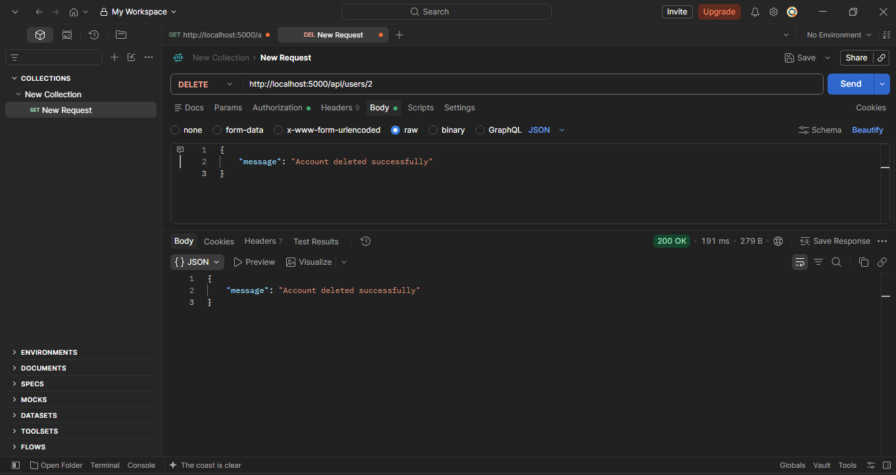
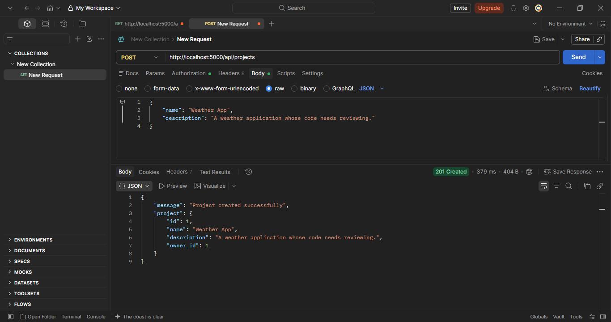
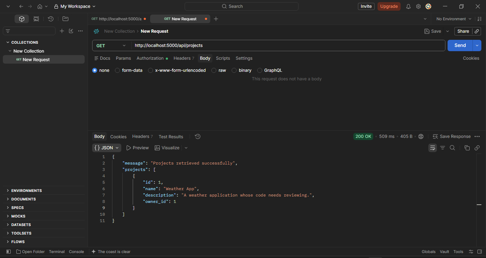
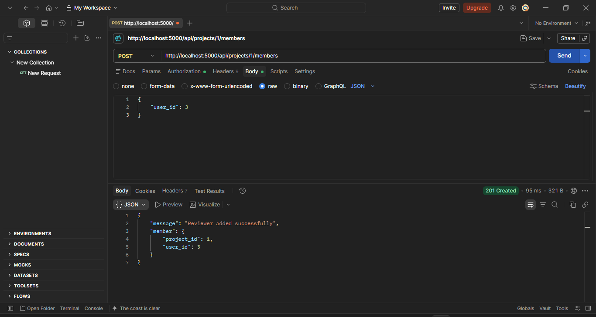
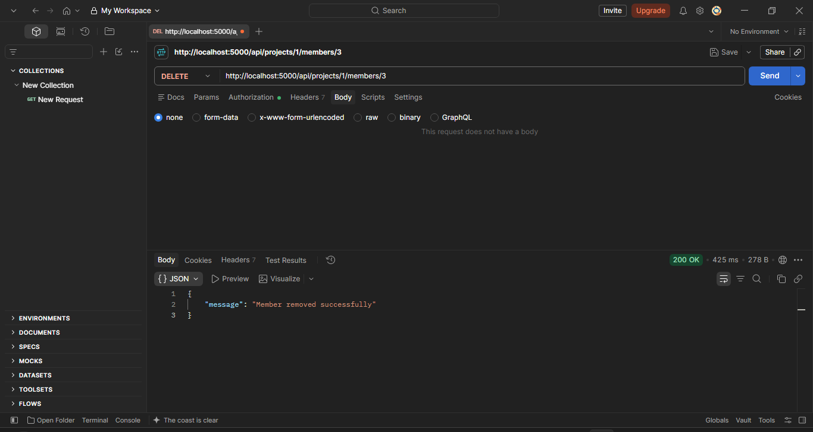

# Code Collaborative Review

A REST API for a collaborative code review platform where users can submit code, review submissions, provide feedback, and manage review workflows.

## Project Structure

```text
Collaborative-Code-Review-Platform/
├── src/
│   ├── config/
│   │   └── database.ts
│   ├── controllers/
│   │   ├── authController.ts
│   │   ├── userController.ts
│   │   └── projectController.ts
│   ├── database/
│   │   └── schema.sql
│   ├── middleware/
│   │   └── authMiddleware.ts
│   ├── routes/
│   │   ├── authRoutes.ts
│   │   ├── userRoutes.ts
│   │   └── projectRoutes.ts
│   ├── service/
│   │   ├── userServices.ts
│   │   └── projectServices.ts
│   ├── types/
│   │   └── application.types.ts
│   └── server.ts
├── Assets/
│   ├── registerUser.png
│   ├── login.png
│   ├── getUserProfile.png
│   ├── updateUserProfile.png
│   ├── invalidProfileUpdate.png
│   ├── profileAccessDenied.png
│   ├── deleteUserProfile.png
│   ├── createProject.png
│   ├── listProjects.png
│   ├── addProjectMember.png
│   └── removeProjectMember.png
├── .env
├── .gitignore
├── package.json
├── package-lock.json
└── tsconfig.json
```

## Setup

1. Initialize the project:

```bash
npm init -y
```

2. Install the main dependencies:

```bash
npm install express pg dotenv
```

3. Install the development dependencies:

```bash
npm install -D typescript nodemon @types/node @types/express @types/pg tsx
```

4. Initialize TypeScript:

```bash
npx tsc --init
```

## Authentication Setup

Install bcrypt and JSON Web Token:

```bash
npm install bcrypt jsonwebtoken
```

Install their TypeScript types:

```bash
npm install -D @types/bcrypt @types/jsonwebtoken
```

## Database Setup

PostgreSQL is used as the database.

The database contains the following tables:

- `users`
- `projects`
- `submissions`
- `comments`

The SQL schema can be found in:

```text
src/database/schema.sql
```

## Sprint 2 - Authentication & User Management

### Register User

**Endpoint**

```http
POST /api/auth/register
```

Registers a new user as either a `submitter` or `reviewer`.

**Example Request**

```json
{
  "name": "Test User",
  "email": "test@example.com",
  "password": "password123",
  "role": "submitter"
}
```

**Result**

```text
201 Created
```

<p align="center">
  
</p>

### Login User

**Endpoint**

```http
POST /api/auth/login
```

Logs in a registered user using their email and password. Returns a JWT token that expires after one hour.

**Example Request**

```json
{
  "email": "test@example.com",
  "password": "password123"
}
```

**Result**

```text
200 OK
```

The response contains a login token and the user's ID, name, email, and role. The password and password hash are not returned.

<p align="center">
  
</p>

### View User Profile

Retrieves the authenticated user's own profile. Users cannot access another user's profile.

**Endpoint**

```http
GET /api/users/:id
```

Replace `:id` with the user ID returned during login.

**Example Request**

```http
GET http://localhost:5000/api/users/1
Authorization: Bearer <your_login_token>
```

In Postman, select **Authorization → Bearer Token** and paste the token received during login. No request body is required.

**Successful Response — 200 OK**

```json
{
  "message": "Profile retrieved successfully",
  "user": {
    "id": 1,
    "name": "Test User",
    "email": "test@example.com",
    "role": "submitter"
  }
}
```

**Error Responses**

| Status | Meaning |
|---|---|
| 400 Bad Request | Invalid user ID. |
| 401 Unauthorized | Missing, invalid, or expired token. |
| 403 Forbidden | Attempting to access another user's profile. |
| 404 Not Found | The authenticated user's account no longer exists. |

**Screenshot**

<p align="center">
  
</p>

### Update User Profile

Allows a logged-in user to update their own name, email, or display picture URL. Only the fields included in the request are changed.

**Endpoint**

```http
PATCH /api/users/:id
```

**Example Request**

Replace `2` with your user ID and use the token returned during login.

```http
PATCH http://localhost:5000/api/users/2
Authorization: Bearer <your_login_token>
Content-Type: application/json
```

```json
{
  "email": "delete-test-updated@example.com",
  "display_picture": "https://example.com/avatar.png"
}
```

The display picture is stored as a URL. To remove it, send `"display_picture": null`.

**Successful Response — 200 OK**

```json
{
  "message": "Profile updated successfully",
  "user": {
    "id": 2,
    "name": "Delete Test Updated",
    "email": "delete-test-updated@example.com",
    "role": "submitter",
    "display_picture": "https://example.com/avatar.png"
  }
}
```

<p align="center">
  
</p>

### Profile Update Validation

Blank names are rejected. The user's existing profile remains unchanged.

**Example Request Body**

```json
{
  "name": " "
}
```

**Response — 400 Bad Request**

```json
{
  "message": "Name must contain between 1 and 100 characters"
}
```

<p align="center">
  
</p>

### Profile Access Protection

Users cannot update another user's profile, even with a valid login token.

**Test**

Send a PATCH request to `/api/users/1` using the token belonging to user `2`.

**Response — 403 Forbidden**

```json
{
  "message": "You can only manage your own profile"
}
```

<p align="center">
  
</p>

### Delete User Account

Allows a logged-in user to permanently delete their own account.

**Endpoint**

```http
DELETE /api/users/:id
```

**Example Request**

```http
DELETE http://localhost:5000/api/users/2
Authorization: Bearer <your_login_token>
```

In Postman, select **Body → none**. Use a disposable account when testing deletion.

**Successful Response — 200 OK**

```json
{
  "message": "Account deleted successfully"
}
```

Accounts linked to projects, submissions, or comments cannot be deleted and return `409 Conflict`.

<p align="center">
  
</p>

### Profile Test Results

| Test | Expected Status | Result |
|---|---|---|
| Update name | 200 OK | Passed |
| Retrieve the updated profile | 200 OK | Passed |
| Update email and display picture URL | 200 OK | Passed |
| Remove display picture using null | 200 OK | Passed |
| Update name with blank spaces | 400 Bad Request | Passed |
| Attempt to change role through profile updates | 400 Bad Request | Passed |
| Attempt to update another user's profile | 403 Forbidden | Passed |
| Delete own disposable account | 200 OK | Passed |

## Sprint 3 - Projects & Membership

All project endpoints require a valid login token. In Postman, select **Authorization → Bearer Token** and paste your token.

### Create Project

Creates a project owned by the logged-in user. The owner ID comes from the verified token.

**Endpoint**

```http
POST http://localhost:5000/api/projects
```

**Example Request Body**

```json
{
  "name": "Weather App",
  "description": "A weather application whose code needs reviewing."
}
```

**Successful Response — 201 Created**

```json
{
  "message": "Project created successfully",
  "project": {
    "id": 1,
    "name": "Weather App",
    "description": "A weather application whose code needs reviewing.",
    "owner_id": 1
  }
}
```

<p align="center">
  
</p>

### List Projects

Returns projects the logged-in user owns or belongs to. No request body is required.

**Endpoint**

```http
GET http://localhost:5000/api/projects
```

**Successful Response — 200 OK**

```json
{
  "message": "Projects retrieved successfully",
  "projects": [
    {
      "id": 1,
      "name": "Weather App",
      "description": "A weather application whose code needs reviewing.",
      "owner_id": 1
    }
  ]
}
```

<p align="center">
  
</p>

### Add Project Member

Allows the project owner to add an existing reviewer. Use the owner's token for this request.

**Endpoint**

```http
POST http://localhost:5000/api/projects/1/members
```

Replace `1` with your project ID. The `user_id` below is the reviewer's user ID.

**Example Request Body**

```json
{
  "user_id": 3
}
```

**Successful Response — 201 Created**

```json
{
  "message": "Reviewer added successfully",
  "member": {
    "project_id": 1,
    "user_id": 3
  }
}
```

<p align="center">
  
</p>

### Remove Project Member

Allows the project owner to remove a member. This removes the membership, not the user's account.

**Endpoint**

```http
DELETE http://localhost:5000/api/projects/1/members/3
```

Here, `1` is the project ID and `3` is the member's user ID.

Use the owner's token and select **Body → none**.

**Successful Response — 200 OK**

```json
{
  "message": "Member removed successfully"
}
```

<p align="center">
  
</p>

### Project Error Responses

| Status | Meaning |
|---|---|
| 400 Bad Request | Invalid request data, adding a non-reviewer, or attempting to remove the owner. |
| 401 Unauthorized | Missing, invalid, or expired token. |
| 403 Forbidden | A non-owner attempts to manage project members. |
| 404 Not Found | The requested project, reviewer, or membership does not exist. |
| 409 Conflict | Duplicate membership, attempting to add the owner, or a referenced record was deleted. |

### Project Test Results

| Test | Expected Status | Result |
|---|---|---|
| Create a project | 201 Created | Passed |
| List the owner's projects | 200 OK | Passed |
| Add a reviewer to a project | 201 Created | Passed |
| Remove a project member | 200 OK | Passed |